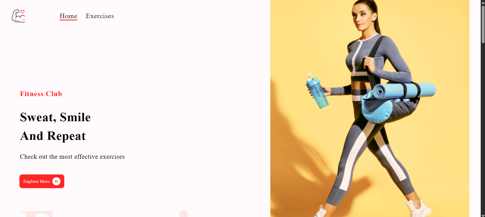
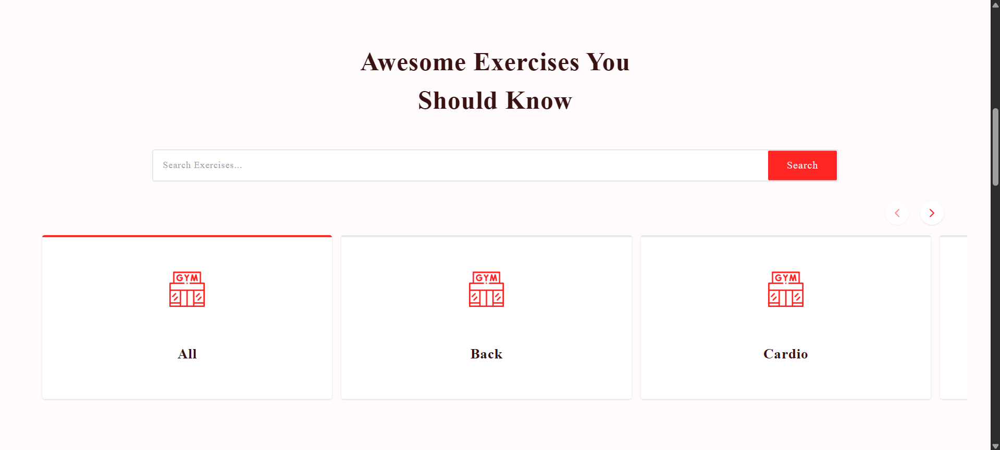
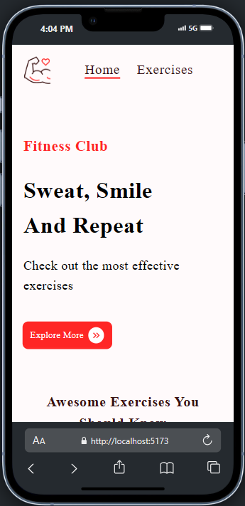
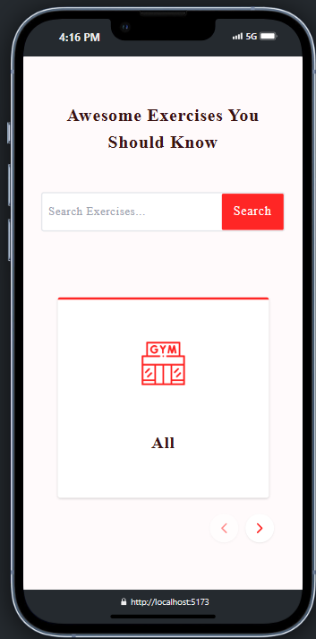

# Gymo

**Gymo** is a dynamic fitness-focused web application designed to help users explore, filter, and learn about gym exercises. It offers a seamless user experience with categorized GIFs, search functionality, detailed pages packed with insights, related content, and video demonstrations. Whether you're a beginner or a pro, **Gymo** makes discovering your next workout move visual, interactive, and educational.

---

## Live Preview

[](https://gymo-sigma.vercel.app/)  

---

## Features

- **Full Exercise Library** with engaging GIFs to demonstrate each workout in action  
- **Search by Exercise Name** to instantly find your desired move  
- **Body Part Filtering** to narrow down exercises based on target areas like chest, legs, abs, etc.  
- **Click-to-Details Navigation**: Tapping any GIF reveals a detailed view of the exercise  
- **Exercise Details Page** includes:
  - Targeted muscle groups
  - Equipment used
  - Exercise instructions
- **YouTube Video Tutorials**: Embedded instructional content to guide proper form  
- **Related Muscle Groups** shown below each exercise to expand workout variations  
- **Similar Exercises Using Same Equipment**: Discover other moves using the same gear  
- **Clean UX/UI** built with React and Tailwind CSS for smooth and consistent interactions

---

## Tech Stack

| Layer        | Tech Used                     |
|--------------|-------------------------------|
| Frontend     | React.js, Vite, TypeScript    |
| Styling      | Tailwind CSS                  |
| Routing      | React Router DOM              |
| Animation    | Framer Motion                 |
| APIs         | Rapid API                     |
| Optimization | Lazy Loading                  |

---

## Project Structure

```
Gymo
├── public                     
│   └── ...
├── src
│   ├── assets/               # Images, icons, previews
│   ├── components/           # Reusable UI components (Cards, Filters, SearchBar)
│   ├── pages/                # Home, ExerciseDetails, etc.
│   ├── App.tsx               # Root component
│   ├── main.tsx              # Entry point
│   ├── utils                 # Reusable helper functions used across the app
│   └── index.css             # Global styles
├── README.md
├── LICENSE
├── .env
├── .gitignore
├── tailwind.config.js
├── package.json
└── vite.config.js
```

---

## Pages Overview

### Home Page

- Displays all available exercise GIFs  
- Includes:  
  - Filter by body part  
  - Live search bar  
  - Scroll-to-view interactivity  

### Exercise Details Page

- Title & animated GIF  
- Muscle group, target & equipment  
- YouTube video tutorials  
- Related muscle group section  
- Similar exercises with same equipment

---

## Previews

Here’s a sneak peek of **Gymo** in action:

### Desktop View




### Mobile View




> Want more? Hover animations, color variants, and dynamic GIF previews come alive in the full app!

---

## Getting Started

1. Clone the repo:

```bash
git clone https://github.com/Kyrillos-Samy1/Gymo.git
```

2. Navigate into the project:

```bash
cd Gymo
```

3. Install dependencies:

```bash
npm install
```

4. Run the development server:

```bash
npm run dev
```

---

## Legal Notice & Usage Policy

This project is intended for **educational and portfolio purposes only**.  
All source code and media assets are owned and maintained by **Kyrillos Samy Doksh Hanna**.

**Unauthorized use, reproduction, or distribution of this code for commercial purposes is strictly prohibited**.

Licensed under the [MIT License](./LICENSE).

> For commercial inquiries, collaborations, or special permissions, please get in touch with me directly at: `kyrillossamy@outlook.com`

---

## Contact

Crafted with vision and style by **Kyrillos Samy Doksh Hanna**  
Email: `kyrillossamy@outlook.com`  
Phone: `+20-1271470997`  
Nickname: `Empire Coder`  
Based in Egypt

---

> **Still learning, still building, always improving.**
